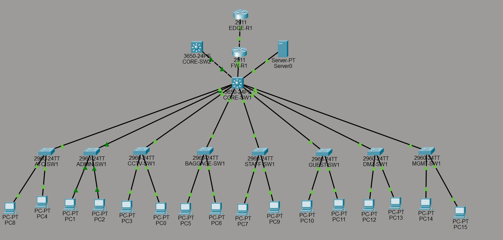
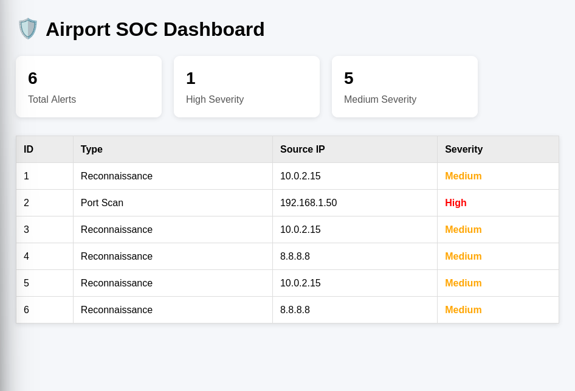

##Airport Security Operations Center (SOC) Monitoring Platform

## Overview

The Airport SOC Monitoring Platform is a cybersecurity monitoring solution developed during an internship project focused on airport network security and Security Operations Center (SOC) workflows.

The project simulates how security analysts monitor network traffic, identify suspicious activities, generate alerts, and visualize incidents through a centralized dashboard. A custom detection engine was developed using Python and Scapy to analyze packet captures and identify reconnaissance and port scanning activities mapped to the MITRE ATT&CK framework.

The platform integrates airport network design, packet analysis, attack simulation, backend development, database storage, and dashboard visualization into a complete end-to-end security monitoring workflow.

---

## Project Architecture

```text
Attack Traffic
      ↓
Packet Capture (tcpdump)
      ↓
PCAP Files
      ↓
Scapy Packet Parser
      ↓
Detection Engine
      ↓
Node.js REST API
      ↓
SQLite Database
      ↓
SOC Dashboard
```

---

## Airport Network Topology

The airport environment was designed and simulated using Cisco Packet Tracer.

Security concepts implemented and studied include:

* VLAN Segmentation
* Access Control Lists (ACLs)
* DHCP Snooping
* Dynamic ARP Inspection (DAI)
* HSRP Redundancy
* Inter-VLAN Communication Controls

### Airport Network Design



---

## Detection Engine

A custom detection engine was developed using Python and Scapy to analyze packet captures and identify suspicious activity.

### Implemented Detection Rules

| Detection Rule           | MITRE ATT&CK Technique            | Severity |
| ------------------------ | --------------------------------- | -------- |
| Reconnaissance Detection | T1595 – Active Scanning           | Medium   |
| Port Scan Detection      | T1046 – Network Service Discovery | High     |

### Reconnaissance Detection

The reconnaissance detector identifies excessive ICMP Echo Request activity commonly associated with host discovery and active scanning.

A false-positive issue was identified during development because both ICMP requests and replies were initially counted. The detection logic was improved to analyze only ICMP Type 8 (Echo Request) packets.

### Port Scan Detection

The port scan detector identifies TCP SYN scanning activity by tracking the number of unique destination ports contacted by a source host.

When the configured threshold is exceeded, a high-severity alert is generated.

---

## Attack Simulation and Validation

Instead of relying solely on sample datasets, attack traffic was generated manually using Kali Linux.

### Reconnaissance Simulation

```bash
for i in {1..20}; do ping -c 1 10.0.2.2; done
```

Captured using:

```bash
sudo tcpdump -i eth0 icmp -w recon_attack.pcap
```

Result:

* Detection Triggered
* MITRE ATT&CK T1595
* Medium Severity Alert Generated

### Port Scan Simulation

```bash
nmap -Pn -sS -p 1-100 10.0.2.2
```

Captured using:

```bash
sudo tcpdump -i eth0 tcp -w portscan_attack.pcap
```

Result:

* Detection Triggered
* MITRE ATT&CK T1046
* High Severity Alert Generated

---

## Backend and Database

### Backend

* Node.js
* Express.js
* REST API Endpoints

Implemented Endpoints:

```http
GET  /alerts
POST /alerts
```

### Database

SQLite is used to store:

* Alert ID
* Timestamp
* Alert Type
* Source IP Address
* Severity

---

## SOC Dashboard

A web-based dashboard was developed using HTML, CSS, and JavaScript to provide centralized visibility into security events.

Features:

* Alert Table
* Severity Classification
* Alert Statistics
* Source IP Tracking
* Incident Visualization

### Dashboard



---

## Technology Stack

### Networking

* Cisco Packet Tracer
* VLANs
* ACLs
* DHCP Snooping
* Dynamic ARP Inspection
* HSRP

### Cybersecurity

* MITRE ATT&CK Framework
* Packet Analysis
* Network Reconnaissance Detection
* Port Scan Detection
* SOC Monitoring Concepts

### Development

* Python
* Scapy
* Node.js
* Express.js
* SQLite
* HTML
* CSS
* JavaScript

---

## Key Learning Outcomes

* Enterprise Network Design
* Security Monitoring Workflows
* Packet Analysis using Scapy
* Detection Engineering
* REST API Development
* Database Integration
* SOC Dashboard Development
* MITRE ATT&CK Mapping
* Security Event Visualization

---

## Future Enhancements

* ARP Poisoning Detection (T1557.002)
* SSH Brute Force Detection (T1110)
* Rogue DHCP Detection
* Real-Time Traffic Monitoring
* Dashboard Analytics
* Threat Intelligence Integration
* Cloud Deployment

---

## Author

**Priyan Acharya**

Airport Security Operations Center (SOC) Monitoring Platform

Internship Project – Navi Mumbai International Airport
